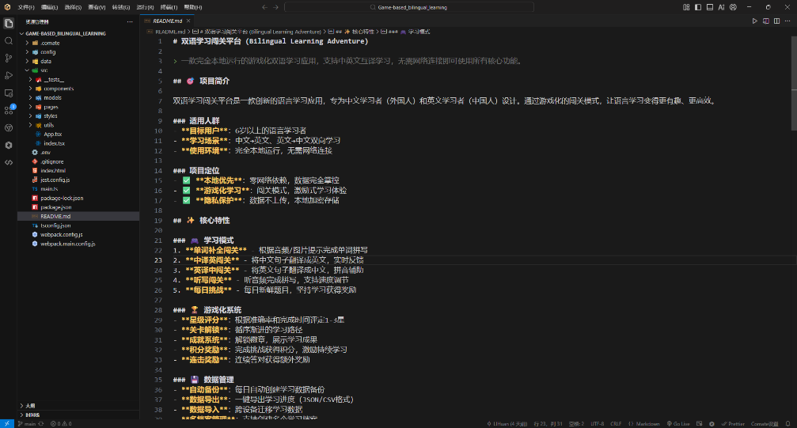

# 双语学习闯关平台 (Bilingual Learning Adventure)


> 一款完全本地运行的游戏化双语学习应用，支持中英文互译学习，无需网络连接即可使用所有核心功能。

## 📖 目录

- [项目简介](#-项目简介)
- [核心特性](#-核心特性)
- [快速开始](#-快速开始)
- [使用指南](#-使用指南)
- [技术栈](#-技术栈)
- [开发流程](#-开发流程)
- [贡献指南](#-贡献指南)
- [许可证](#-许可证)

## 🎯 项目简介

双语学习闯关平台是一款创新的语言学习应用，专为中文和英文学习者设计。通过游戏化的闯关模式，让语言学习变得更有趣、更高效。

- **目标用户**：6 岁以上的语言学习者
- **学习场景**：中文 ↔ 英文双向学习
- **使用环境**：完全本地运行，无需网络连接
- **特色**：本地优先、游戏化学习、隐私保护

## ✨ 核心特性

### 🎮 学习模式

1. **单词补全闯关** - 根据音频/图片提示完成单词拼写
2. **中译英闯关** - 将中文句子翻译成英文，实时反馈
3. **英译中闯关** - 将英文句子翻译成中文，拼音辅助
4. **听写闯关** - 听音频完成拼写，支持速度调节
5. **每日挑战** - 每日新鲜题目，坚持学习获得奖励

### 🏆 游戏化系统

- **星级评分**：根据准确率和完成时间评定 1-3 星
- **关卡解锁**：循序渐进的学习路径
- **成就系统**：解锁徽章，展示学习成果
- **积分奖励**：完成挑战获得积分，激励持续学习
- **连击奖励**：连续答对获得额外奖励

### 💾 数据管理

- **自动备份**：每日自动创建学习数据备份
- **数据导出**：一键导出学习进度（JSON/CSV 格式）
- **数据导入**：跨设备迁移学习数据
- **多档案管理**：支持创建多个学习档案
- **重新开始**：保留历史记录的同时重新开始游戏

### 🤖 AI 增强

- 智能内容生成（百度文心一言 3.5-8k 模型）
- 个性化推荐和内容缓存
- 本地题库作为降级方案

### 📊 学习追踪

- 进度可视化和详细统计
- 个人学习报告和完整历史记录

## 🚀 快速开始

### 环境要求

- **Node.js**：v18.0+ （推荐通过 Conda 管理：`conda activate node22`）
- **操作系统**：Windows 10+, macOS 10.14+, Ubuntu 18.04+
- **磁盘空间**：至少 200MB 可用空间

### 安装步骤

1. **克隆项目**

```bash
git clone <repository-url>
cd Game-based_bilingual_learning
```

2. **激活 Node 环境**（如使用 Conda）

```bash
conda activate node22
```

3. **安装依赖**

```bash
npm install
```

4. **配置 AI 服务**（可选）

```bash
# 复制配置示例
cp config/ai-service.example.json config/ai-service.json
# 编辑配置文件，填入API密钥
```

5. **启动应用**

```bash
# 开发模式
npm run dev
npm start

# 生产模式
npm run build
npm start
```

## 📘 使用指南

- 每天学习至少 20 分钟，保持连续性
- 从基础关卡开始，循序渐进
- 利用听写功能加强听力训练
- 定期查看学习报告，了解进度
- 参与每日挑战，获得额外奖励

## 🖼️ 应用截图

<details>
<summary>点击查看截图</summary>




</details>

## 🛠️ 技术栈

- **前端框架**：React 18 + TypeScript 4.9
- **状态管理**：React Context API + Custom Hooks
- **UI 组件**：定制化组件 + CSS Modules
- **构建工具**：Webpack 5
- **测试框架**：Jest + React Testing Library
- **本地存储**：IndexedDB + LocalStorage
- **AI 集成**：百度文心一言 API (ERNIE 3.5-8k)

## 🔄 开发流程

本项目采用 **百度 Comate ZuLu** 智能体进行全生命周期开发，实现从需求分析到功能实现的一体化流程：

1. **需求分析与系统设计**：需求挖掘、架构建模（DDD）、技术选型、API 设计（RESTful）
2. **编码与实现**：自动代码生成、重构优化、设计模式应用、性能优化
3. **测试与质量保障**：单元测试、集成测试、性能测试、回归测试
4. **文档与知识沉淀**：代码注释、API 文档、用户指南、开发指南
5. **部署与维护**：构建优化、CI/CD、日志系统、监控告警

### 开发管理与协作

- 版本控制：Git + 语义化版本管理
- 项目管理：敏捷开发 + Scrum 迭代
- 代码审查：基于 PR 的代码质量把控
- 文档协作：Markdown 标准 + 自动生成

## 🤝 贡献指南

我们欢迎所有形式的贡献，无论是新功能、bug 修复还是文档改进。请遵循以下步骤：

1. Fork 项目
2. 创建您的特性分支 (`git checkout -b feature/AmazingFeature`)
3. 提交您的更改 (`git commit -m 'Add some AmazingFeature'`)
4. 将您的更改推送到分支 (`git push origin feature/AmazingFeature`)
5. 开启一个 Pull Request

## 📄 许可证

本项目基于 MIT 许可证开源 - 查看 [LICENSE](LICENSE) 文件了解更多细节

---

**最后更新**：2025-11-25  
**文档版本**：v1.2.0
