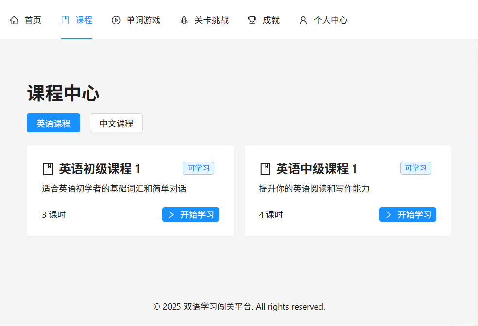
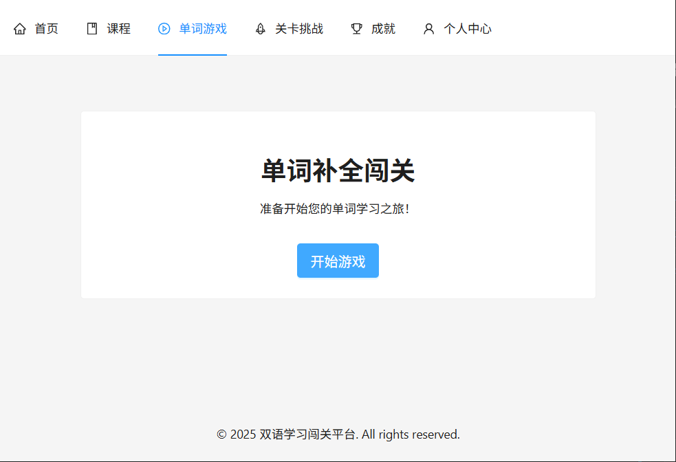
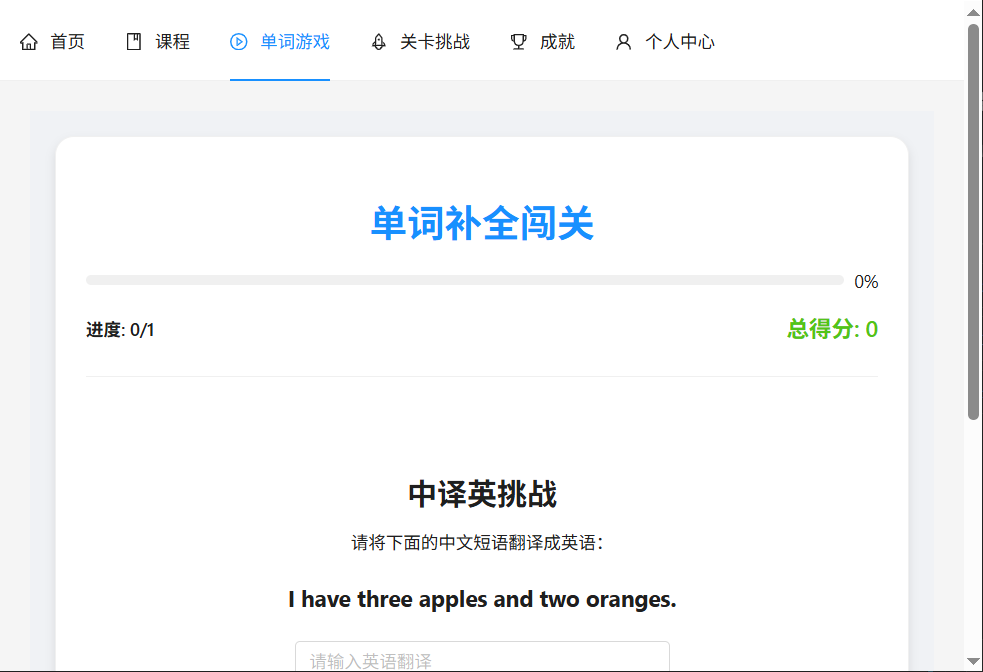
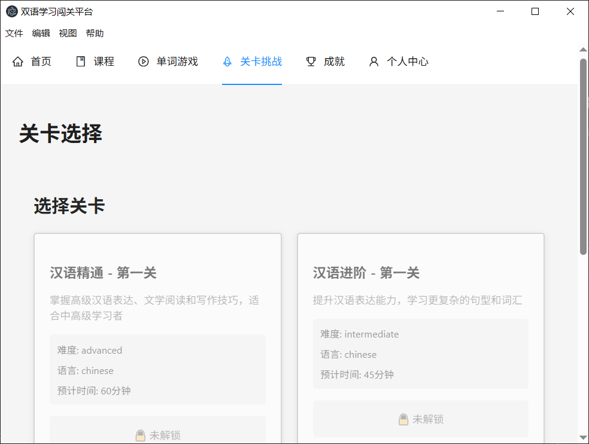
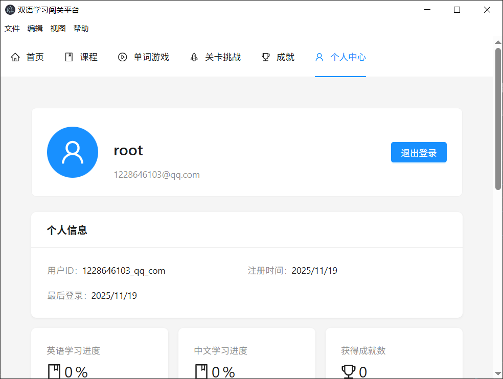

# 双语学习闯关平台 (Bilingual Learning Adventure)

> 一款完全本地运行的游戏化双语学习应用，支持中英文互译学习，无需网络连接即可使用所有核心功能。

## 🎯 项目简介

双语学习闯关平台是一款创新的语言学习应用，专为中文学习者（外国人）和英文学习者（中国人）设计。通过游戏化的闯关模式，让语言学习变得更有趣、更高效。

### 适用人群
- **目标用户**：6岁以上的语言学习者
- **学习场景**：中文→英文、英文→中文双向学习
- **使用环境**：完全本地运行，无需网络连接

### 项目定位
- ✅ **本地优先**：零网络依赖，数据完全掌控
- ✅ **游戏化学习**：闯关模式，激励式学习体验
- ✅ **隐私保护**：数据不上传，本地加密存储

## ✨ 核心特性

### 🎮 学习模式
1. **单词补全闯关** - 根据音频/图片提示完成单词拼写
2. **中译英闯关** - 将中文句子翻译成英文，实时反馈
3. **英译中闯关** - 将英文句子翻译成中文，拼音辅助
4. **听写闯关** - 听音频完成拼写，支持速度调节
5. **每日挑战** - 每日新鲜题目，坚持学习获得奖励

### 🏆 游戏化系统
- **星级评分**：根据准确率和完成时间评定1-3星
- **关卡解锁**：循序渐进的学习路径
- **成就系统**：解锁徽章，展示学习成果
- **积分奖励**：完成挑战获得积分，激励持续学习
- **连击奖励**：连续答对获得额外奖励

### 💾 数据管理
- **自动备份**：每日自动创建学习数据备份
- **数据导出**：一键导出学习进度（JSON/CSV格式）
- **数据导入**：跨设备迁移学习数据
- **多档案管理**：支持创建多个学习档案
- **重新开始**：保留历史记录的同时重新开始游戏

### 🤖 AI 增强
- **智能内容生成**：集成百度文心一言3.5-8k模型
- **个性化推荐**：基于学习进度的智能题目推荐
- **内容缓存**：本地缓存AI生成内容，提升响应速度
- **降级方案**：AI服务不可用时，自动切换本地题库

### 📊 学习追踪
- **进度可视化**：学习时长、完成度、正确率图表
- **详细统计**：单词掌握情况、薄弱环节分析
- **学习报告**：个人学习报告和建议
- **历史记录**：完整的学习历史追溯


### AI 服务
- **主要服务**：百度文心一言3.5-8k（OpenAI兼容接口）
- **降级方案**：本地题库 + 规则引擎
- **缓存策略**：内存缓存 + 文件缓存双层机制

## 🚀 快速开始

### 环境要求
- **Node.js**：v18.0+ （推荐通过Conda管理：`conda activate node22`）
- **操作系统**：Windows 10+, macOS 10.14+, Ubuntu 18.04+
- **磁盘空间**：至少200MB可用空间

### 安装步骤

1. **克隆项目**
```bash
git clone <repository-url>
cd Game-based_bilingual_learning
```

2. **激活Node环境**（如使用Conda）
```bash
conda activate node22
```

3. **安装依赖**
```bash
npm install
```

4. **配置AI服务**（可选）
```bash
# 复制配置示例
cp config/ai-service.example.json config/ai-service.json
# 编辑配置文件，填入API密钥
```

5. **启动应用**
```bash
# 开发模式
npm run dev
npm start

# 生产模式
npm run build
npm start
```
### 学习建议
- 每天至少学习20分钟，保持连续性
- 先完成基础关卡，循序渐进
- 利用听写功能加强听力训练
- 定期查看学习报告，了解进度
- 参与每日挑战，获得额外奖励

### 截图







**最后更新**：2025-11-20  
**文档版本**：v1.0.0